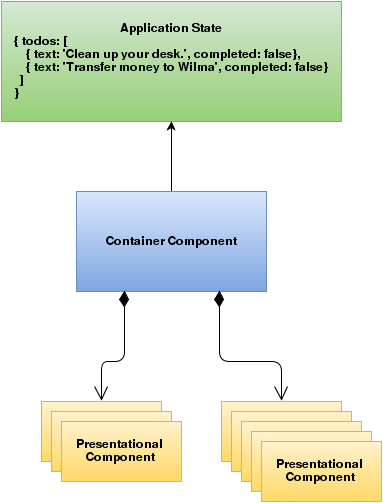

## aurelia-redux
This is a demo project showing how to integrate redux and rxjs with aurelia in a [react-redux](https://github.com/reactjs/react-redux) way.

### How to run
After cloning run:

    $ au run --watch

### Introduction

One of the patterns that helps keeping our apps clear and maintainable as they grow is the Data-Down, Actions-Up pattern. It puts clear constraints on the data flow between parent and child components: the data that a child component needs to render its view (or to do its job in general) are provided by its parent and the only way to change the data is via so called actions. This is in contrast to two-way data bindings, where data changes that affect the model are immediately propagated to the corresponding template, and conversely, any changes made in the UI are promptly reflected in the underlying model. Magic! This may seem convenient for unexperienced developer at first, but when employed in larger scale and more complex applications, two-way data binding can often become more of a headache than a blessing ( finding out where to mutate your data, tracing the source of mutated data. etc). Even in smaller applications, the Data-Down, Actions-Up brings important benefits - it makes the code easy to read and reason about, which drastically lowers the probability of make a mistake.
The Data-Down, Actions-Up pattern is well known to (originates from?) the Ember and React communities, but more and more developers are appreciating its clean and easy to follow principles.

### Redux
We could realise data-down, actions-up pattern using combination of Aurelia's native one-way data bindings and EventAggregator Events, but to achieve a true uni-directional data-flow we will use Redux. From the Redux documentation:

Redux is a predictable state container for JavaScript apps.
(...)
It helps you write applications that behave consistently, run in different environments (client, server, and native), and are easy to test. On top of that, it provides a great developer experience, such as live code editing combined with a time traveling debugger.
You can use Redux together with React, or with any other view library.

Redux achieves its goals by observing the three fundamental principles:

 1. [Single source of truth](http://redux.js.org/docs/introduction/ThreePrinciples.html#single-source-of-truth). \
    The state of your whole application is stored in an object tree within a single store.
 2. [State is read-only](http://redux.js.org/docs/introduction/ThreePrinciples.html#state-is-read-only). \
    The only way to change the state is to emit an action, an object describing what happened.
 3. [Changes are made with pure functions](http://redux.js.org/docs/introduction/ThreePrinciples.html#changes-are-made-with-pure-functions). \
    To specify how the state tree is transformed by actions, you write pure reducers.

Learn Redux from its author Dan Abramov in a video course consisting of 30 videos: [Getting Started with Redux](https://egghead.io/series/getting-started-with-redux).
Redux integrates well with most of the frameworks, but there is a healthy pattern around that helps making it smooth.

### Application State, Container Components, and Presentational Components

I will use a short paragraph from the [ember-redux](http://www.ember-redux.com/ddau/) community:

> The core concept is that we should separate the responsibility of components into 2 groups. The first group is given the label Container Components and they act like the “backend of the frontend” in a way. They will be “connected” to the datasource and delegate to other components for any html that is rendered on the page. The second group is given the label Presentational Components and as you can probability guess the only job they have is to render html given some object/data.

The data source is the application state - the one and only one source of truth for the whole app.
The picture below illustrates the idea:

### Using Redux with Aurelia

Our way of integrating Redux with Aurelia is inspired by [react-redux](https://github.com/reactjs/react-redux) - the official React bindings for Redux. react-redux takes the burden of creating the container components away using their [connect](https://github.com/reactjs/react-redux/blob/master/docs/api.md#connectmapstatetoprops-mapdispatchtoprops-mergeprops-options) function, here we will try to do something similar - in Aurelia world having React on the horizon.

We need to provide three things:

1. Passing a subset of an application state (possibly mapped to some other object) from parent to child component. We call this subset _props_.
2. Making the props dynamic - if the relevant subset of the state changes, so should the related props.
3. Dispatching actions up from child to parent (or presentational component to a container component) also happens via functions passed from parent to the child via _props_. We need to facilitate that as well.

### Container components

As depicted in the picture above, container components are the only one that have access to the application state. A pure container component would have the following structure:

**TodoListContainer.js**

    import {inject} from 'aurelia-framework';
	import {AureliaProps} from 'services/props/AureliaProps';

    class TodoListContainerProps extends AureliaProps {
      mapStateToProps(state) {
        return {
          todos: state.todos
        };
      }
 
      mapDispatchToProps() {
        return {
          todoToggle: (id) => {
             this.applicationStateCoordinator.dispatch(this.actionCreators.todoToggle(id));
          },
          todoAdd: (id, text) => {
            this.applicationStateCoordinator.dispatch(this.actionCreators.todoAdd(id, text));
          }
        };
      }
    }
  
    @inject(TodoListContainerProps)
    export class TodoListContainer {
      constructor(props) {
        this.props = props;
      }
      
      detached() {
        this.props.unsubscribe();
      }
    }

**TodoListContainer.html**

    <template>
      <require from="./TodoList"></require>
      <todo-list props.bind="props"></todo-list>
    </template>

We see that the container component simply wraps the presentations component `todo-list` and provides it with props via one-way data binding. The `todo-list` presentation component does not have to do much to access the props from its parent:

**ToDoList.js**

    export class TodoList {
      @bindable props;

      @observable todoText;

      constructor() {
        this.styles = styles;
        this.buttonDisabled = 'disabled';
      }

      propsChanged() {
        console.log('propsChanged=', this.props);
      }

      todoTextChanged() {
        if (this.todoText.trim().length === 0) {
          this.buttonDisabled = 'disabled';
        } else {
          this.buttonDisabled = '';
        }
      }

      addTodo() {
        this.props.todoAdd(this.props.todos.length, this.todoText);
        this.todoText = '';
      }
    }

    const styles = {
      container: {
        margin: '10px',
        padding: 0,
        width: '600px'
      },

      todoList: {
        display: 'flex',
        'flex-flow': 'column nowrap'
      },

      inputGroup: {
        display: 'flex',
        margin: '10px 0'
      },

      button: {
        'margin-left': '15px',
        'padding': '10px'
      }
    }

**ToDoList.html**

    <template>
      <require from="components/todo/Todo"></require>

      

        <h2>Todo list:</h2>
        

          Please add some todos and have fun!
        

        

          <todo id.bind="todo.id"
                text.bind="todo.text" 
                completed.bind="todo.completed"
                toggle.bind="props.todoToggle">
          </todo>
        

        <form submit.trigger="addTodo()">
          

            <input type="text" value.bind="todoText">
            <button style.bind="styles.button" disabled.bind="buttonDisabled" type="submit">Add Todo</button>
          

        </form>
      

    </template>

We see that the relevant data is passed down to the children `todo` components together with actionable `todoToggle` function. Additionally, the `TodoList` component provides a form with an edit field and a button that allow us to add more todo items.
Important to note here, that we are not trying to be dogmatic about two-way bindings - they are usually fine in form controls where data need to be passed from the view to the view model. This is exactly what we do with the `todoText` that is bound to the form's input value in the `TodoList` component. Notice though that this two-way binding stops at the component level and does not propagate further. We also do not use two way bindings with custom components: two-way binding is only ok between view controls and view model.
Finally, we have our `todo` component:

**ToDo.js**

    import { bindable } from 'aurelia-framework';

    export class Todo {
      @bindable id;
      @bindable text;
      @bindable completed;
      @bindable toggle;

      constructor() {
        this.styles = styles;
      }

      toggleCompleted() {
        this.toggle(this.id);
      }

      completedChanged() {
        this.updateStyle();
      }

      updateStyle() {
        if (this.completed) {
          this.styles = {...styles, todo: {...styles.todoCompleted} };
        } else {
          this.styles = {...styles, todo: {...styles.todoNotCompleted} };
        }
      }
    }

    const styles = {
      container: {
        display: 'flex',
        'flex-flow': 'row nowrap',
        'align-items': 'center',
        width: '100%'
      },
      buttonContainer: {
        flex: 1,
        display: 'block',
        margin: '0 10px'
      },
      button: {
        padding: '15px'
      },
      todoCompleted: {
        flex: 1,
        'text-decoration': 'line-through'
      },
      todoNotCompleted: {
        flex: 1,
        'text-decoration': 'none'
      }
    };
    
**ToDo.html**

	<template>
      

        
${this.text}

        <button click.delegate="toggleCompleted()">Toggle Completed</button>
      

    </template>

When the user clicks on the _Toggle Completed_ button the action is triggered via the `toggle` function that was provided from the parent. The `Todo` item does not maintain its internal state - it is driven by the state changes on the parent. Thanks to this, `Todo` is simple to reason about. In general, one-way data flow makes reasoning about the system easier and less error prone, even though it may give impression of more boilerplate code.

### How does it work? 

If you read the code above, you notice that there is no single mention of Redux. The container component - `TodoListContainer` - is provided with convenient `props` object (via native Aurelia dependency injection mechanism) that already contains only the subset of the actual application state:

    class TodoListContainerProps extends AureliaProps {
      mapStateToProps(state) {
        return {
          todos: state.todos
        };
      }
     
      mapDispatchToProps() {
        return {
          todoToggle: (id) => {
            this.dispatch(this.actionCreators.todoToggle(id));
          },
          todoAdd: (id, text) => {
            this.dispatch(this.actionCreators.todoAdd(id, text));
          }
        };
      }
    }

    @inject(TodoListContainerProps)
    export class TodoListContainer {
      constructor(props) {
        this.props = props;
      }

      detached() {
        this.props.unsubscribe();
      }
    }

In order to declare which part of the state our container component is interested in, all what is needed is a class with two required methods (inspired by [react-redux](https://github.com/reactjs/react-redux)): `mapStateToProps` and `mapDispatchToProps`. First represents the _data down_ pattern, the second _actions up_. The _Props_ class (as we will call it from now on), extends the AureliaProps class where the magic happens:

    import {inject} from 'aurelia-framework';

    import {ApplicationStateCoordinator} from 'services/state-management/ApplicationStateCoordinator';
    import {ActionCreators} from 'application-state/ActionCreators';

    @inject(ApplicationStateCoordinator, ActionCreators)
    export class AureliaProps {
      constructor(applicationStateCoordinator, actionCreators) {
        this.applicationStateCoordinator = applicationStateCoordinator;
        this.actionCreators = actionCreators;
        this.observable = this.applicationStateCoordinator.observable((state) => {
            return this.mapStateToProps(state);
        });
        this.subscription = this.observable.subscribe((props) => {
          Object.assign(this, props);
        });
        Object.assign(this, this.mapDispatchToProps());
      }

      dispatch(action) {
        this.applicationStateCoordinator.dispatch(action);
      }

      unsubscribe() {
        this.subscription.unsubscribe();
      }
    }

The AureliaProps class does two things:
1. It provides the `ApplicationStateCoordinator` and `ActionCreators` instances to the receiver. Thanks to this `TodoListContainerProps` class can conveniently dispatch the actions. The actions themselves are conveniently created with `ActionCreators` that hide the details of the internal action format.
2. It makes props object dynamically changing every time the relevant part of the state changes. This is the job of the `ApplicationStateCoordinator` that provides _rxjs_ observable that will fire everytime the selection of the state specified by the `mapStateToProps` that we described above.
 
Below we present the code of the `ApplicationStateCoordinator` class:

    import { createStore } from 'redux';
    import Rx from '@reactivex/rxjs';

    import { applicationReducer } from 'application-state/Reducers';

    export class ApplicationStateCoordinator {

      constructor() {
        this.reduxStore = createStore(applicationReducer);
      }

      observable(select) {
        return Rx.Observable.create((observer) => {
          let currentState;
          let dispose = this.reduxStore.subscribe(() => {
            let nextState = select(this.reduxStore.getState());
            if (nextState !== currentState) {
              observer.next(nextState);
            }
          });
          observer.next(select(this.reduxStore.getState()));
          return dispose;
        });
      }

      dispatch(action) {
        this.reduxStore.dispatch(action);
      }
    }

The `observable` method returns a function that will unsubscribe from following the (sub)state changes. We use it in the detached method of the container component:

    detached() {
      this.props.unsubscribe();
    }

